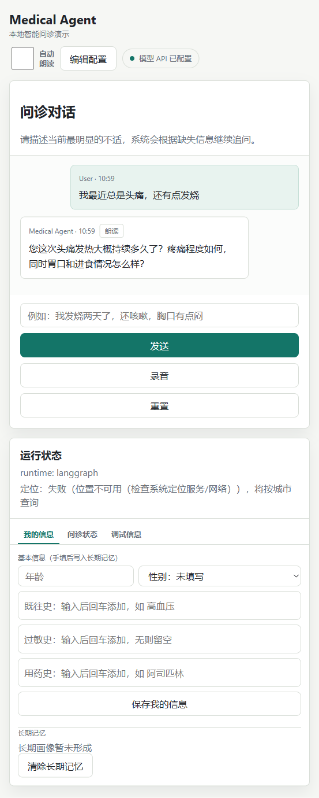
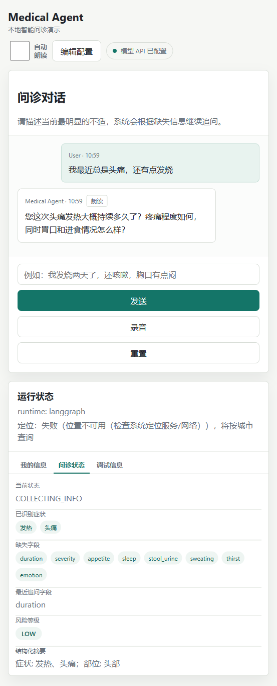

# Medical Agent

Medical Agent 是一个本地网页版智能问诊 Agent 原型。它不是医疗诊断系统，重点展示多轮问诊中的状态管理、风险分层、动态追问、工具调用和 LLM 接入。

当前默认使用 Flask 提供网页界面，Agent 编排默认走 LangGraph；没有配置模型 API 时也可以使用 Mock 演示模式体验流程。

## 对话示例

以一次真实 DeepSeek 模型下的风寒感冒问诊为例（5 轮收敛）：

左侧为问诊对话（摘录：开场主诉与追问、最终建议，中间追问轮省略），右侧为运行状态栏（已识别症状、缺失字段、风险等级、LLM 调用指标与执行轨迹实时展示）。最终建议末尾附 RAG 检索注入的「知识库参考」段（参考方剂 + 知识库版本行）与安全边界说明：

| 问诊对话 | 运行状态 |
| --- | --- |
|  |  |

## 快速开始

### Windows 一键安装

双击运行：

```bat
install.bat
```

安装脚本会创建 `.venv` 虚拟环境，并安装 `requirements.txt` 中的依赖。

### 启动网页

双击运行：

```bat
start.bat
```

或在命令行运行：

```bash
python start.py
```

启动后浏览器会打开：

```text
http://localhost:5000
```

如果浏览器没有自动打开，可以手动访问上面的地址。

## 首次配置 API

第一次启动时，如果项目根目录还没有 `config.env` 或没有 API Key，网页会先显示配置界面。

你可以选择：

- `DeepSeek`：填写 DeepSeek API URL、API Key、模型名等配置
- `Mock 演示模式`：不调用外部模型，只体验本地流程

点击“保存并开始”后，配置会写入本地 `config.env`。API Key 不会在网页里明文回显。

## 常用命令

启动网页但不自动打开浏览器：

```bash
python start.py --no-browser
```

指定端口启动：

```bash
python start.py --port 5050
```

运行系统检查：

```bash
python test_system.py
```

运行评测集（回放 15 个带标注的多轮对话剧本，默认 Mock 模式保证确定性）：

```bash
python evaluation/run_eval.py
```

只跑单个用例或查看每轮明细：

```bash
python evaluation/run_eval.py --case 04_wind_cold_full_path --verbose
```

用真实 LLM 手动跑评测（输出非确定，仅供参考，不计入 CI 基线）：

```bash
python evaluation/run_eval.py --provider deepseek
```

真实 LLM 联调冒烟（需先在 config.env 配好 key；未配置时直接退出，不做网络调用）：

```bash
python evaluation/smoke_real_llm.py
```

检索后端质量对比（BM25 vs TF-IDF，同一金标准集）：

```bash
python evaluation/compare_retrievers.py
```

命令行演示模式：

```bash
python main.py
```

## 配置文件

网页配置会生成：

```text
config.env
```

示例字段：

```env
LLM_PROVIDER=deepseek
DEEPSEEK_API_URL=https://api.deepseek.com/v1/chat/completions
DEEPSEEK_API_KEY=your_deepseek_api_key
DEEPSEEK_MODEL=deepseek-chat
DEEPSEEK_MAX_TOKENS=1024
DEEPSEEK_TEMPERATURE=0.2
DATA_DIR=data
LOG_DIR=logs
```

真实 provider 下建议 `DEEPSEEK_MAX_TOKENS=1024`：RAG 注入后最终回复变长，512 可能截断安全边界行（见 `config.env.example` 注释）。

可选：附近医院数据源（均留空则用演示数据，功能不受影响）：

```env
AMAP_API_KEY=          # 高德地图 Web 服务 key，配置后按城市检索真实医院 POI
HOSPITAL_DATA_URL=     # 或静态 JSON 数据源，优先级高于高德
```

注意：这两个手填键不在 web 配置页管理范围内，经配置页保存可能被清，丢失后重新添加即可。

`config.env` 已加入 `.gitignore`，不要提交真实 API Key。

## 数据与日志

运行时会自动生成两个本地目录（均已加入 `.gitignore`）：

```text
data/profiles/{user_id}.json     长期用户画像（JSON 文件持久化）
data/sessions/{session_id}.json  会话状态与对话历史
logs/app.log                     统一日志（滚动文件）
logs/events.jsonl                结构化事件流（执行轨迹）
```

服务重启后长期画像与会话状态不丢失；网页侧栏的“执行轨迹”区块和 `/api/debug/trace` 接口读取的就是事件流数据。

## 知识库与评测集

中医知识以 JSON 数据文件外置在 `knowledge/data/`，加载时做 schema 校验（必填字段、枚举值、版本号），内容调整不需要改代码：

```text
knowledge/data/syndrome_rules.json           辨证规则（16 证型，含治则方向与调理建议）
knowledge/data/term_normalization.json       口语别名 → 规范术语归一化表
knowledge/data/chief_complaint_followup.json 主诉追问优先级
knowledge/data/red_flags.json                高风险红旗信号表
knowledge/data/risk_rules.json               风险分层规则（外置，schema 校验）
knowledge/data/formulas.json                 方剂语料（44 条，与证型挂钩）
knowledge/data/health_advice.json            调护语料（32 条）
knowledge/data/faq.json                      常见问答语料（14 条）
```

三类语料共 90 条，供 RAG 检索注入：最终建议前用 BM25（零依赖自实现）按 top 证型候选与主诉检索方剂/调护/FAQ，以“知识库参考”段（含知识库版本行）注入真实 provider 的最终回复；检索失败静默跳过，Mock 路径行为不变。检索器后端可切换（BM25 / TF-IDF），`evaluation/compare_retrievers.py` 用同一金标准集对比两者命中与排名。其中 32 条（经方 20 + 药食同源调护 12）整理自开源项目 [jangviktor-web/nihaixia-app](https://github.com/jangviktor-web/nihaixia-app)（MIT License，条内 `source` 字段标注），内容为白话转述、附免责声明。

`evaluation/cases/` 下是 15 个带逐轮断言的对话剧本，覆盖高风险急诊、典型证型完整问诊、信息不足、前后矛盾、脉诊接入与拒绝、高龄风险、红旗否认豁免、风险规则命中等场景；`evaluation/run_eval.py` 回放剧本走真实 LangGraph 链路，输出通过明细与汇总指标（风险识别准确率、红旗 precision/recall、收敛轮数、replan 率）。

知识库内容为**演示级**示例，需经中医专业审核后方可用于实际场景。

## 项目结构

```text
app.py                 Flask 网页入口
start.py               本地网页启动器
config_manager.py      本地配置读写和脱敏
main.py                命令行演示入口
templates/index.html   配置页、问诊页和运行状态侧栏
agent/                 Agent 编排、路由和控制器
llm/                   LLM 调用封装（含埋点、重试与指标累计）
memory/                会话记忆、用户画像与 JSON 文件持久化
tools/                 症状、风险、指南、知识检索工具，及工具协议与注册表
knowledge/             中医知识结构；data/ 下为外置知识数据（JSON）
mcp_bridge/            MCP 客户端桥接（配置校验/同步调用/工具适配）
mcp_servers/           仓库内 MCP 试点服务（hospital_locator 附近医院）
mcp_servers.json       MCP 服务接入配置（stdio，可选 call_timeout）
observability/         日志、JSONL 事件流与指标汇总
evaluation/            评测集：多轮对话剧本、回放评测、检索对比与真实 LLM 冒烟
docs/                  架构与指南文档、对话示例截图
test_system.py         系统检查脚本
```

### MCP 接入

`mcp_bridge` 把外部 MCP 服务适配为仓库统一工具协议（`{server}_{tool}` 命名、ToolResult 降级、本地参数 schema 校验）；子进程环境白名单最小化，不透传宿主全量环境。当前试点服务 `hospital_locator`（附近医院查询）：会话中抽取的城市（或 `MEDICAL_AGENT_LOCATION` 环境变量）驱动查询，高风险升级回复可附就近医院清单；数据源演示级，可配置切真实地图（见“配置文件”）。`pulse_device` 为硬件接入占位（默认禁用）。

## 当前能力

- 首次运行网页配置模型 API
- 保存配置后无需重启即可使用新配置
- 支持 DeepSeek 和 Mock 演示模式
- 多轮问诊状态管理
- 症状抽取、缺失字段追问、风险等级展示
- 长期用户画像和短期会话状态分离，JSON 文件持久化，重启不丢失
- LangGraph 作为默认 Agent runtime
- 统一工具协议（ToolResult + 版本 + 异常降级）与工具注册表
- 中医知识外置化：辨证规则、术语归一化、主诉追问、红旗信号均由 `knowledge/data/` 驱动
- 知识检索工具（纯 Python 加权打分，零外部依赖），指南建议附治则方向与调理建议
- RAG 检索注入：BM25/TF-IDF 可切换后端，命中语料（方剂/调护/FAQ）以“知识库参考”段附在真实 provider 最终建议末尾，附知识库版本行
- MCP 接入：stdio 桥接 + 工具适配与降级，试点服务 hospital_locator（附近医院，数据源可切高德地图/静态端点）
- 风险规则外置（risk_rules.json）：症状组合、既往史、高龄等条件命中即升级
- 红旗否认豁免：用户明确否认的红旗不误报、不误升级
- 城市槽位：自由文本抽取城市，驱动就近医院查询（会话城市优先于环境变量）
- Planner 纯规则决策：阈值配置化、主诉模糊匹配、证型定向追问、review 拦截高风险/过早收束
- 系统化评测集：15 个带标注剧本回放真实图链路，输出风险准确率、红旗 precision/recall、收敛轮数、replan 率；另提供检索后端对比与真实 LLM 冒烟脚本
- 可观测性：统一日志、结构化事件流、LLM 耗时/token 指标、网页侧栏执行轨迹
- 调试接口 `/api/debug/trace`：查看当前会话的节点耗时、风险结果与 replan 记录

## 注意

本项目仅用于工程原型和演示，不替代医生面诊、诊断或治疗建议。高风险症状应及时就医。
